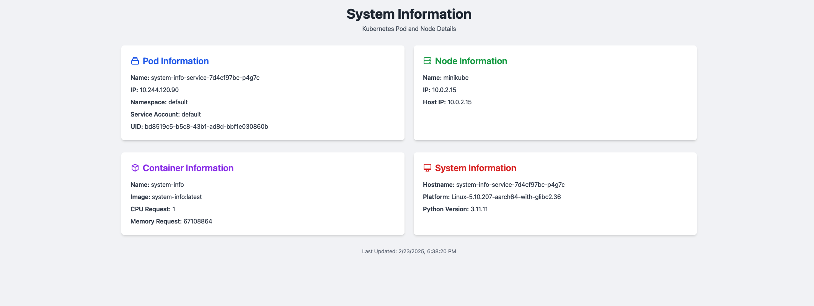

# podInfo
Stupid python based API to display Pod and Node information in a nice HTML page.
 - exposes /v1/whoami to display the pod and node info.
 - exposes /health/local for kubelet health checks.


#### Development (non-prod use-case only)

- start minikube cluster
``` 
    minikube start
    eval $(minikube docker-env)
```
Build the image using:

```docker build -t system-info:latest -f Dockerfile .```

Deploy the service using the provided bare-minimum deployment.yaml

``` kubectl apply -f ./deployment/* ```

check status of pods via:

```kubectl get pods ```

Port-forward to access the systeminfo service like this:

```kubectl port-forward deployments/system-info-service 8080:8080```

Open a Browser tab and then access the url as below :
```http://localhost:8080/v1/whoami```

### Production 

Utilize the CI/CD process to build and deploy the service to your cluster.

#### Example



